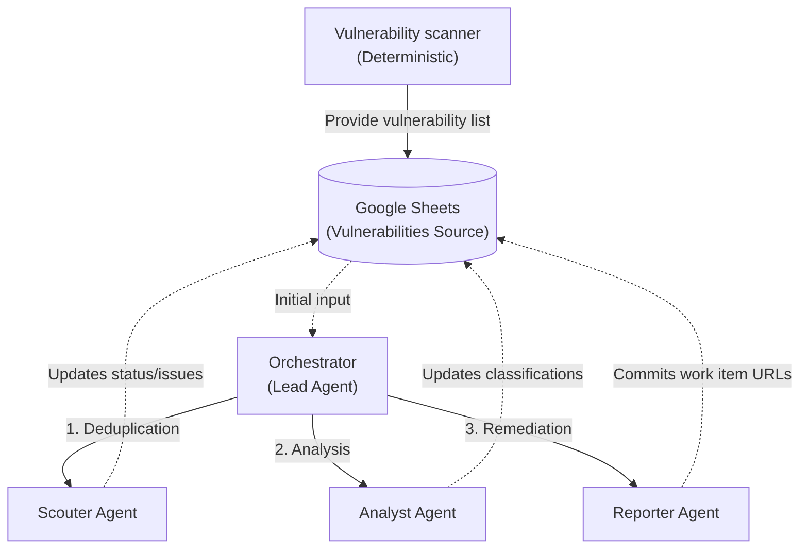
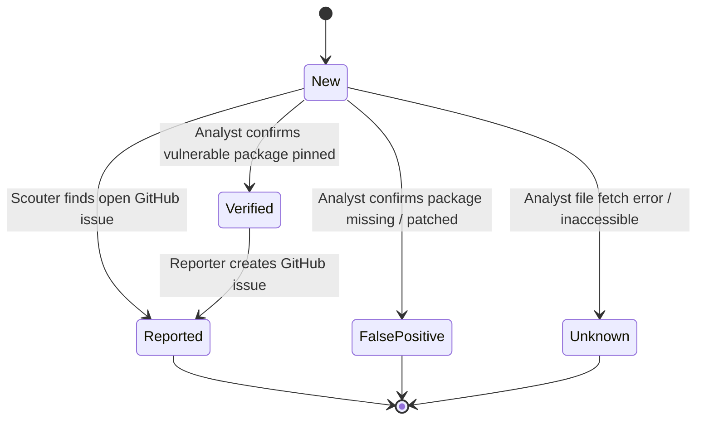

# Project Overview & Architecture Documentation

 
 

## 1. Project Scope
The development of this project is carried out in stages. The current phase corresponds to the course deliverable, in which the agent executes the analysis and reporting of security vulnerabilities detected in the environment. Subsequent phases are described in the project evolution section.

 
 

## 2. The Opportunity and the Initial Idea
The solution was born from the need to reduce the manual workload that falls on the security analyst when reviewing and managing alerts. The complete vision of the project contemplates a fully automated agent capable of:
*   Reading security alerts generated in the environment.
*   Analyzing them and determining if they correspond to false positives.
*   Generating a resolution specification for alerts that do represent a real threat.
*   Creating a Pull Request in the repository with the proposed changes.

It is estimated that, in its initial analysis and reporting phase alone, the agent will save the security analyst between 3 and 4 hours per week.

 
 

### Why an approach based on autonomous agents?
Determining whether a vulnerability applies to a specific environment is a complex task. Each environment has its own technology, was built under particular business rules, and uses specific versions of tools and libraries. An autonomous agent allows for dynamic reasoning about that context, something that a rigid, predefined workflow fails to do with the same precision.

 
 

## 3. The Iterative Journey and Evolution
*   **Deterministic Workflow:** At the beginning, the workflow was deterministic and featured a manual trigger to fetch alerts from Google Sheets.
*   **Inclusion of the First Model:** Then, the first agent was incorporated to search for information about each vulnerability. Over the weeks, the structure evolved.
*   **Agent Specialization:** Initially, a single agent handled the entire process, which generated many errors. For this reason, the system was divided into multiple agents with more specific tasks, executed sequentially.
*   **Implementation of the Orchestrator and Memory:** Subsequently, memory was added to the orchestrator model, and an orchestrator was established to coordinate the agents' actions.
*   **Human-in-the-loop Control:** Finally, a human validation step was integrated to pause and authorize the workflow before the agent creates an issue in GitHub.

 
 

## 4. Current State of the Solution
The conceptual architectural diagram of the implemented ecosystem is presented below, along with the role of each specialized node that forms part of the workflow.

Architectural Diagram

Flow diagram

 
 

## 5. Challenges Faced
During development, two main challenges arose:
*   **Transition from Linear Flow to Orchestration:** Moving from a linear execution flow to a model where an orchestrator agent manages the work and makes decisions dynamically required a significant investment of time and iterative adjustments.
*   **Session Management:** It was necessary to explore and understand how to manage sessions within the workflow to ensure that context was properly maintained between the different execution steps.

 
 

## 6. Key Learnings
The development of the project allowed for the acquisition of significant knowledge in agentic artificial intelligence and the implementation of open specifications (open spec). From the lessons learned, two fundamental areas stand out:
*   **Technical Integration with Google Services:** The consumption of Google APIs was explored in depth, resolving critical aspects of authentication and OAuth protocols for effective communication via n8n.
*   **Structuring and Applying Specifications:** The capability to design precise specifications was developed, enabling the agent to reason about the context and justify its resolution proposals.

 
 

## 8. Governance, Risk, and Adoption

 
 

### 8.1 Identified Risks
Three main risks associated with the use of the agent were identified:
1.  **Incorrect Classification of Alerts:** The agent could classify a real security alert as a false positive, causing it to be ignored. If this happens with a critical vulnerability, the consequences for the organization could be significant.
2.  **Input Data Manipulation:** If incorrect or malicious information is entered into the spreadsheet used as the data source, the agent could generate recommendations that introduce backdoors or facilitate malware installation in the systems.
3.  **Location Errors Due to Model Hallucinations:** If the agent hallucinates and creates issues in incorrect repositories, it produces unnecessary noise in the development teams' workflows and erodes developer trust in the system.

 
 

### 8.2 Current Impact Level
Given that the workflow is not designed to operate fully autonomously at this stage, the potential impact of the scenarios described above is limited. Human intervention acts as a security control that effectively mitigates these risks.
