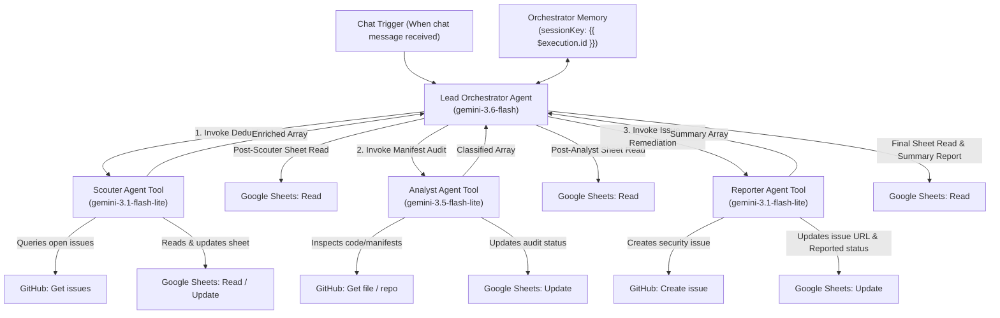
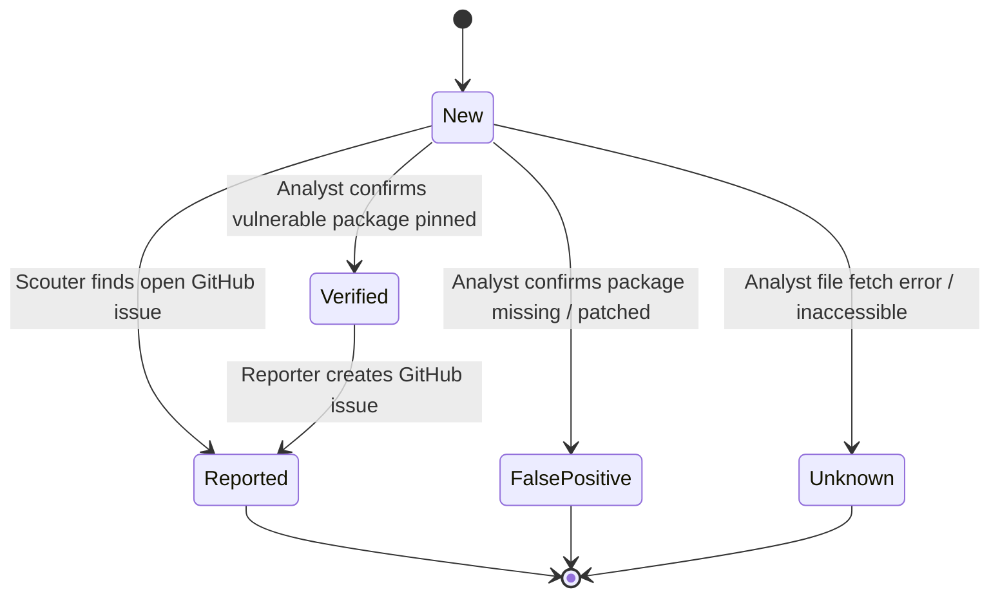

# Multi-Agent Security Vulnerability Pipeline — Agent Architecture (`agents.md`)

This document defines the agent architecture, system prompts, data flows, memory strategies, and **developer maintenance procedures** for the n8n Multi-Agent Security Pipeline ([n8n-workflow.json](n8n-workflow.json)).

---

## 1. System Architecture Overview

The system processes security vulnerability tracking rows stored in Google Sheets through a 3-stage multi-agent pipeline coordinated by a **Lead Orchestrator Agent**.



---

## 2. Core Data Schema & State Lifecycle

Every item processed across all sub-agents adheres strictly to the core schema:

| Field | Type | Description | Allowed Values / Format |
|---|---|---|---|
| `CVE` | String | CVE Identifier | `CVE-YYYY-XXXX` |
| `Repository` | String | Target GitHub Repository | `owner/repo` |
| `Title` | String | Vulnerability Summary | e.g. `SQL Injection in auth module` |
| `Status` | Enum | Lifecycle State | `New` \| `Verified` \| `False positive` \| `Reported` \| `Unknown` |
| `Severity` | String | Risk Severity Rating | `CRITICAL` \| `HIGH` \| `MEDIUM` \| `LOW` |
| `Kind` | String | Vulnerability Category | `SSTi`, `SQLi`, `RCE`, `XSS`, etc. |
| `Work item` | String | GitHub Issue URL | Issue URL or empty string `""` |

### State Transition Diagram



---

## 3. Agent Specifications

### 3.1 Lead Orchestrator Agent

- **Type**: `@n8n/n8n-nodes-langchain.agent` (v3.1)
- **Model**: `models/gemini-3.6-flash`
- **Memory**: `Orchestrator Memory` (`@n8n/n8n-nodes-langchain.memoryBufferWindow`, `sessionKey = "={{ $execution.id }}"`)
- **Prompt Reference**: [`prompts/orchestrator.md`](prompts/orchestrator.md) (v1.1.0)
- **Primary Responsibility**:
  - Coordinates sequential execution: **Scouter $\rightarrow$ Analyst $\rightarrow$ Reporter**.
  - **Mandatory Sheet Refresh Protocol**: Executes `Get row(s) in sheet in Google Sheets` after EVERY sub-agent completes to read the fresh, authoritative sheet state before moving to the next stage.
  - Relays up-to-date data arrays between sub-agents and renders the final executive report.

#### Allowed Tools
1. `Scouter` (sub-agent tool)
2. `Analyst` (sub-agent tool)
3. `Reporter` (sub-agent tool)
4. `Get row(s) in sheet in Google Sheets3`

---

### 3.2 Scouter Agent (Deduplication & Sync)

- **Type**: `@n8n/n8n-nodes-langchain.agentTool` (v3)
- **Model**: `models/gemini-3.1-flash-lite`
- **Prompt Reference**: [`prompts/scouter.md`](prompts/scouter.md) (v1.0.0)
- **Primary Responsibility**:
  - Fetches all vulnerability rows from Google Sheets.
  - Searches target GitHub repositories for open issues matching `CVE` or package keywords.
  - **Direct Sheet Write**: Commits `Status = "Reported"` and `Work item` URL directly to Google Sheets for any duplicate found.
  - Returns enriched array to Orchestrator.

#### Allowed Tools
1. `Get row(s) in sheet in Google Sheets1`
2. `Get issues of a repository in GitHub`
3. `Update row in sheet in Google Sheets`

---

### 3.3 Security Analyst Agent (Vulnerability Verification)

- **Type**: `@n8n/n8n-nodes-langchain.agentTool` (v3)
- **Model**: `models/gemini-3.5-flash-lite`
- **Prompt Reference**: [`prompts/analyst.md`](prompts/analyst.md) (v1.0.0)
- **Primary Responsibility**:
  - Receives the enriched array from Scouter.
  - Audits dependency manifests (`requirements.txt`, `package.json`, `pyproject.toml`, `go.mod`, `Dockerfile`, etc.) across root and subdirectories for all `New` items.
  - **Direct Sheet Write**: Classifies items as `Verified`, `False positive`, or `Unknown`, and commits the updated `Status` directly to Google Sheets.
  - Returns classified array to Orchestrator.

#### Allowed Tools
1. `Get row(s) in sheet in Google Sheets`
2. `Get a repository in GitHub1`
3. `Get a file in GitHub`
4. `Update row in sheet in Google Sheets1`

---

### 3.4 Reporter Agent (Security Remediation)

- **Type**: `@n8n/n8n-nodes-langchain.agentTool` (v3)
- **Model**: `models/gemini-3.1-flash-lite`
- **Prompt Reference**: [`prompts/reporter.md`](prompts/reporter.md) (v1.0.0)
- **Primary Responsibility**:
  - Receives the classified array from Analyst.
  - Creates security tracking issues in GitHub for all items with `Status == "Verified"`.
  - **Direct Sheet Write**: Commits `Status = "Reported"` and the new GitHub `Work item` issue URL directly to Google Sheets.
  - Returns final summary array to Orchestrator.

#### Allowed Tools
1. `Get row(s) in sheet in Google Sheets2`
2. `Create an issue in GitHub`
3. `Update row in sheet in Google Sheets2`

---

## 4. State & Memory Management Strategy

### Execution-Scoped Memory

To prevent context pollution between separate executions while preserving the Orchestrator's internal ReAct loop memory:

1. **Session Key**: The `Orchestrator Memory` node uses `sessionKey: "={{ $execution.id }}"`.
2. **Per-Message Wipe**: When a new chat message triggers a workflow run, n8n assigns a brand-new `$execution.id`.
3. **Behavior**:
   - During **Execution N**, the Orchestrator remembers all sub-agent calls and tool results.
   - When **Execution N+1** starts, the memory key changes, initializing a 100% clean memory context without leftover history from prior messages.

---

## 5. Developer & AI Maintenance Guide (Updating `n8n-workflow.json`)

This section serves as an operational guide for any developer or AI assistant applying future changes to [`n8n-workflow.json`](n8n-workflow.json).

### 5.1 Source of Truth Mapping

When updating the workflow, the system prompts in the `prompts/` directory are the **Authoritative Source of Truth**.

| Node Name | Node ID | Prompt File | JSON System Prompt Path |
|---|---|---|---|
| `Orchestrator` | `edc233d1-5505-43ea-a409-c934d4f88984` | [`prompts/orchestrator.md`](prompts/orchestrator.md) | `nodes[].parameters.options.systemMessage` |
| `Scouter` | `97ccc5b3-79e6-4946-94db-78e62d2ea69b` | [`prompts/scouter.md`](prompts/scouter.md) | `nodes[].parameters.options.systemMessage` |
| `Analyst` | `8fb433d8-d16a-4eee-aa1e-aa098116b102` | [`prompts/analyst.md`](prompts/analyst.md) | `nodes[].parameters.options.systemMessage` |
| `Reporter` | `c267bf2f-83ed-4315-9f49-9277f38e5c66` | [`prompts/reporter.md`](prompts/reporter.md) | `nodes[].parameters.options.systemMessage` |

---

### 5.2 Step-by-Step Change Protocol

Whenever a user requests workflow modifications (e.g., adding a new agent stage, altering tool rules, or modifying memory policies):

#### Step 1: Update Prompt Files in `prompts/`
First, edit the corresponding markdown file in `prompts/` (`orchestrator.md`, `scouter.md`, `analyst.md`, or `reporter.md`). Ensure version headers (e.g., `v1.2.0`) and rule updates are accurately formatted.

#### Step 2: Synchronize `n8n-workflow.json` Node System Prompts
Read the raw content from `prompts/<agent>.md` and write it directly into the `parameters.options.systemMessage` property of the corresponding node inside [`n8n-workflow.json`](n8n-workflow.json).

> [!IMPORTANT]
> Always escape special characters (newlines `\n`, quotes `"`, tabs `\t`) appropriately for valid JSON strings when editing `n8n-workflow.json`.

#### Step 3: Validate Sub-Agent Tool Expressions
Ensure sub-agent tool nodes (`@n8n/n8n-nodes-langchain.agentTool`) use the correct input relay expression:
```json
"text": "={{ $json.input }}"
```

#### Step 4: Verify Node Connections in `connections` Block
If new tools or agents are added, confirm they are registered under `connections` in [`n8n-workflow.json`](n8n-workflow.json):
- Sub-agent to Orchestrator: `type: "ai_tool"`
- Model to Agent: `type: "ai_languageModel"`
- Memory to Agent: `type: "ai_memory"`
- Sheet/GitHub tool to Agent: `type: "ai_tool"`

#### Step 5: Verify Execution Memory Setting
Ensure the Orchestrator's memory node (`Orchestrator Memory`) maintains the execution-scoped wiping key:
```json
"parameters": {
  "sessionKey": "={{ $execution.id }}"
}
```

#### Step 6: Validate JSON Syntax
Always run JSON validation before finalizing:
```bash
python3 -c "import json; json.load(open('n8n-workflow.json'))"
```
