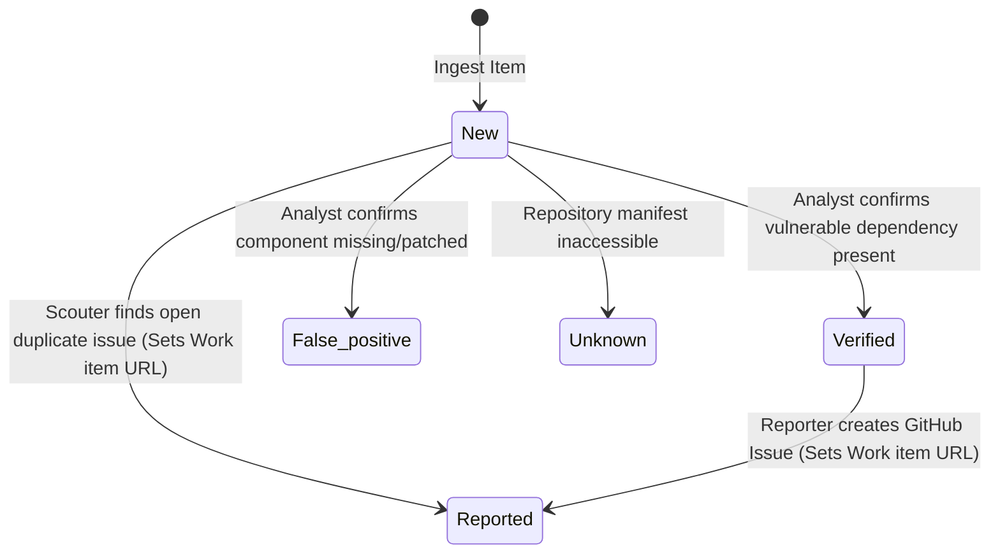

# Project Specification: Security Pipeline Prompt Manager (SPPM)

<system_overview>
The Security Pipeline Prompt Manager (SPPM) is a CLI-driven meta-agent tool designed to analyze, optimize, and synchronize system prompts for a 3-agent security vulnerability triage and remediation pipeline operating within **n8n AI Agent nodes** powered by **Gemini models**.
</system_overview>

<workspace_structure>
```text
├── prompts/
│   ├── scouter.md        # System prompt for Scouter (Deduplication)
│   ├── analyst.md        # System prompt for Security Analyst
│   └── reporter.md       # System prompt for Reporter (Remediation)
├── core_schema.json      # Schema definitions for vulnerability data
└── spec.md               # Pipeline specification & optimization rules
```
</workspace_structure>

<core_schema>
Every item managed by the pipeline strictly conforms to the following 7-field schema:
* **CVE** (String): CVE identifier (e.g., `CVE-2024-1234`).
* **Repository** (String): Target GitHub repository path (`owner/repo`).
* **Title** (String): Title or brief description of the vulnerability.
* **Status** (Enum): Current pipeline status (`New` | `Verified` | `False positive` | `Reported` | `Unknown`).
* **Severity** (String): Risk level (`CRITICAL` | `HIGH` | `MEDIUM` | `LOW`).
* **Kind** (String): Vulnerability classification (e.g., `SSTi`, `RCE`, `SQLi`, `Dependency`).
* **Work item** (String): Direct URL to corresponding GitHub Issue (or empty if unassigned).
</core_schema>

<pipeline_architecture>
The pipeline follows a **linear chain** with no central orchestrator. Each agent receives the output of the previous agent as its input, enriches it, commits its findings directly to Google Sheets, and passes the result to the next agent.

```
Chat Trigger → Scouter → Analyst → Reporter
```

1. **Scouter**: First in the chain. Reads the vulnerability item from Google Sheets, searches GitHub for existing open issues (`state:open`) to detect duplicates, updates the sheet with its findings, and passes the enriched item to the Analyst.
2. **Security Analyst**: Receives the Scouter output. Audits repository dependency manifests (`requirements.txt`, `package.json`, etc.) to classify `New` items as `Verified`, `False positive`, or `Unknown`. Updates the sheet with its findings and passes the result to the Reporter.
3. **Reporter**: Last in the chain. Receives the Analyst output. Creates GitHub issues for items with `Status == "Verified"`, captures the issue URL, and updates the sheet with the final `Reported` status and `Work item` URL.
</pipeline_architecture>

<state_machine_rules>


| Source Status | Agent Triggered | Allowed Target Status | Required Actions |
| :--- | :--- | :--- | :--- |
| `New` / Any | **Scouter** | `Reported` (if duplicate found) | Search GitHub `state:open`. If found, capture URL into `Work item`. Update sheet. |
| `New` | **Security Analyst** | `Verified` \| `False positive` \| `Unknown` | Audit dependency manifests via GitHub tool. Update sheet. |
| `Verified` | **Reporter** | `Reported` | Create GitHub Issue labeled `security`. Capture new URL into `Work item`. Update sheet. |
</state_machine_rules>

<n8n_tool_bindings>
| Agent Node | n8n Tool Name | Responsibility |
| :--- | :--- | :--- |
| **Scouter** | `Get row(s) in sheet in Google Sheets` | Ingest vulnerability item from sheet |
| **Scouter** | `Update row in sheet in Google Sheets` | Commit deduplication findings to sheet |
| **Scouter** | `Get issues of a repository in GitHub` | Query `state:open` issues in target repo |
| **Security Analyst** | `Get row(s) in sheet in Google Sheets` | Read current item state |
| **Security Analyst** | `Update row in sheet in Google Sheets` | Commit audit classification to sheet |
| **Security Analyst** | `Get a file in GitHub` | Inspect package manifests & configuration files |
| **Reporter** | `Get row(s) in sheet in Google Sheets` | Read verified items |
| **Reporter** | `Update row in sheet in Google Sheets` | Commit `Reported` status & issue URL to sheet |
| **Reporter** | `Create an issue in GitHub` | Create security tracking issue in repo |
| **Reporter** | `Get a repository in GitHub` | Validate target repository existence |
</n8n_tool_bindings>

<cli_commands>
* `sppm validate`: Validates all prompts in `/prompts` against state machine rules and Core Schema constraints.
* `sppm update --agent [name]`: Uses LLM to refine an agent system prompt for n8n tool accuracy.
* `sppm sync-n8n`: Exports prompts formatted for injection into n8n AI Agent System Message fields.
* `sppm audit-logic`: Audits prompts to ensure verification logic requires actual file inspection.
</cli_commands>

<integration_guardrails>
* **Linear Chain Rule**: Each agent passes its enriched output directly to the next agent in the chain. There is no central orchestrator mediating data flow.
* **Distributed Sheet Access**: Each agent is responsible for its own Google Sheets read/write operations at the end of its step, before passing control to the next agent.
* **State Locking**: Reporter execution MUST be locked strictly to items where `Status == "Verified"`.
* **Prompt Versioning**: Every time any file in the `prompts/` folder is modified, its version MUST be incremented. The version is represented directly under the first `#` header in each file starting with the letter `v` (e.g., `v0.0.2`).
</integration_guardrails>