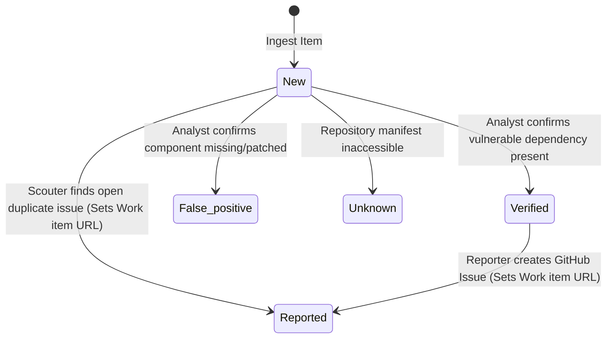

# Project Specification: Security Pipeline Prompt Manager (SPPM)

<system_overview>
The Security Pipeline Prompt Manager (SPPM) is a CLI-driven meta-agent tool designed to analyze, optimize, and synchronize system prompts for a 4-agent security vulnerability triage and remediation pipeline operating within **n8n AI Agent nodes** powered by **Gemini models**.
</system_overview>

<workspace_structure>
```text
├── prompts/
│   ├── orchestrator.md   # System prompt for Lead Orchestrator
│   ├── analyst.md        # System prompt for Security Analyst
│   ├── scouter.md        # System prompt for Scouter (Deduplication)
│   └── reporter.md       # System prompt for Reporter (Remediation)
├── core_schema.json      # Schema definitions for vulnerability data
└── spec.md               # Pipeline specification & optimization rules
```
</workspace_structure>

<core_schema>
Every item managed by the pipeline strictly conforms to the following 7-field schema:
* **CVE** (String): CVE identifier (e.g., `CVE-2024-1234`).
* **Repository** (String): Target GitHub repository path (`owner/repo`).
* **Title** (String): Title or brief description of the vulnerability.
* **Status** (Enum): Current pipeline status (`New` | `Verified` | `False positive` | `Reported` | `Unknown`).
* **Severity** (String): Risk level (`CRITICAL` | `HIGH` | `MEDIUM` | `LOW`).
* **Kind** (String): Vulnerability classification (e.g., `SSTi`, `RCE`, `SQLi`, `Dependency`).
* **Work item** (String): Direct URL to corresponding GitHub Issue (or empty if unassigned).
</core_schema>

<pipeline_architecture>
1. **Single Point of I/O**: Only the **Lead Orchestrator** reads from and writes to the tracking source (Google Sheets). Sub-agents are completely isolated from Google Sheet tools.
2. **Single-Item Processing Loop**: The Orchestrator iterates through items one-by-one, passing a single item payload to specialized sub-agents and immediately committing state updates back to the sheet after each sub-agent execution.
3. **Decoupled Specialized Sub-Agents**:
   * **Scouter**: Searches GitHub for existing open issues (`state:open`) matching the CVE/component to prevent duplicate issue creation.
   * **Security Analyst**: Audits repository dependency manifests (`requirements.txt`, `package.json`, etc.) to classify items with status `New`.
   * **Reporter**: Creates GitHub issues for items with status `Verified` and captures the issue URL.
</pipeline_architecture>

<state_machine_rules>


| Source Status | Agent Triggered | Allowed Target Status | Required Actions |
| :--- | :--- | :--- | :--- |
| `New` / Any | **Scouter** | `Reported` (if duplicate found) | Search GitHub `state:open`. If found, capture URL into `Work item`. |
| `New` | **Security Analyst** | `Verified` \| `False positive` \| `Unknown` | Audit dependency manifests via GitHub tool. |
| `Verified` | **Reporter** | `Reported` | Create GitHub Issue labeled `security`. Capture new URL into `Work item`. |
</state_machine_rules>

<n8n_tool_bindings>
| Agent Node | n8n Tool Name | Responsibility |
| :--- | :--- | :--- |
| **Orchestrator** | `Get row(s) in sheet in Google Sheets` | Ingest vulnerability dataset |
| **Orchestrator** | `Update row in sheet in Google Sheets` | Commit updated `Status` & `Work item` per row |
| **Scouter** | `Get issues of a repository in GitHub` | Query `state:open` issues in target repo |
| **Security Analyst** | `Get a file in GitHub` | Inspect package manifests & configuration files |
| **Reporter** | `Create an issue in GitHub` | Create security tracking issue in repo |
| **Reporter** | `Get a repository in GitHub` | Validate target repository existence |
</n8n_tool_bindings>

<cli_commands>
* `sppm validate`: Validates all prompts in `/prompts` against state machine rules and Core Schema constraints.
* `sppm update --agent [name]`: Uses LLM to refine an agent system prompt for n8n tool accuracy.
* `sppm sync-n8n`: Exports prompts formatted for injection into n8n AI Agent System Message fields.
* `sppm audit-logic`: Audits prompts to ensure verification logic requires actual file inspection.
</cli_commands>

<integration_guardrails>
* **1:1 Pairing Rule**: Every sub-agent result must be immediately written to Google Sheets by the Orchestrator before starting the next item.
* **State Locking**: Reporter execution MUST be locked strictly to items where `Status == "Verified"`.
* **Zero Direct Sheet Access in Sub-Agents**: Sub-agents MUST NOT contain instructions or tool bindings for Google Sheet read/write operations.
* **Prompt Versioning**: Every time any file in the `prompts/` folder is modified, its version MUST be incremented. The version is represented directly under the first `#` header in each file starting with the letter `v` (e.g., `v0.0.2`).
</integration_guardrails>